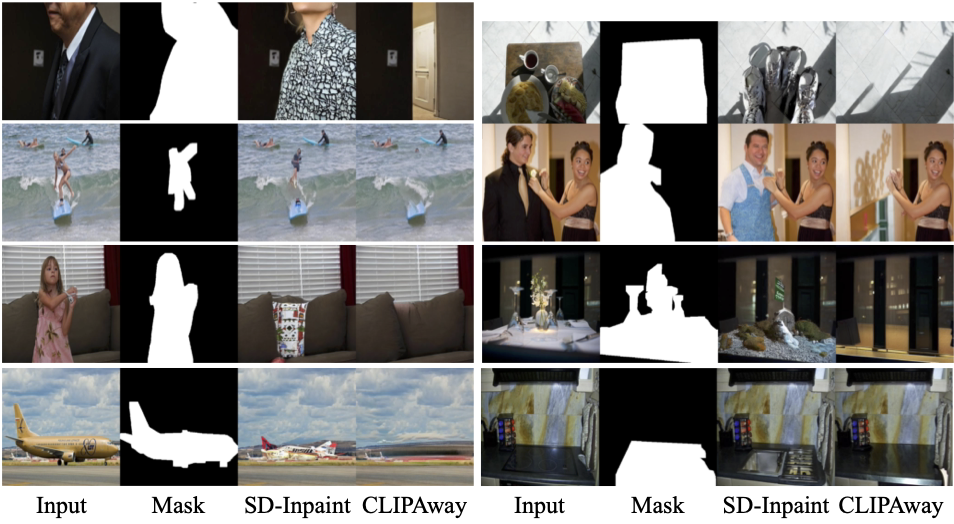

# CLIPAway
>
> Code will be published soon!
> 
[Paper](https://arxiv.org/abs/2406.09368) | [Project Website](https://yigitekin.github.io/CLIPAway/) | [BibTeX](#bibtex)


**CLIPAway: Harmonizing Focused Embeddings for Removing Objects via Diffusion Models**
Yiğit Ekin, Ahmet Burak Yildirim, Erdem Eren Çağlar, Aykut Erdem, Erkut Erdem, Aysegul Dundar

### **Abstract:** 

> Advanced image editing techniques, particularly inpainting, are essential for seamlessly removing unwanted elements while preserving visual integrity. Traditional GAN-based methods have achieved notable success, but recent advancements in diffusion models have produced superior results due to their training on large-scale datasets, enabling the generation of remarkably realistic inpainted images.Despite their strengths, diffusion models often struggle with object removal tasks without explicit guidance, leading to unintended hallucinations of the removed object. To address this issue, we introduce CLIPAway, a novel approach leveraging CLIP embeddings to focus on background regions while excluding foreground elements. CLIPAway enhances inpainting accuracy and quality by identifying embeddings that prioritize the background, thus achieving seamless object removal. Unlike other methods that rely on specialized training datasets or costly manual annotations, CLIPAway provides a flexible, plug-and-play solution compatible with various diffusion-based inpainting techniques. 
> 

### BibTeX

```
@misc{ekin2024clipaway,
      title={CLIPAway: Harmonizing Focused Embeddings for Removing Objects via Diffusion Models}, 
      author={Yigit Ekin and Ahmet Burak Yildirim and Erdem Eren Caglar and Aykut Erdem and Erkut Erdem and Aysegul Dundar},
      year={2024},
      eprint={2406.09368},
      archivePrefix={arXiv},
      primaryClass={id='cs.CV' full_name='Computer Vision and Pattern Recognition' is_active=True alt_name=None in_archive='cs' is_general=False description='Covers image processing, computer vision, pattern recognition, and scene understanding. Roughly includes material in ACM Subject Classes I.2.10, I.4, and I.5.'}
}
```